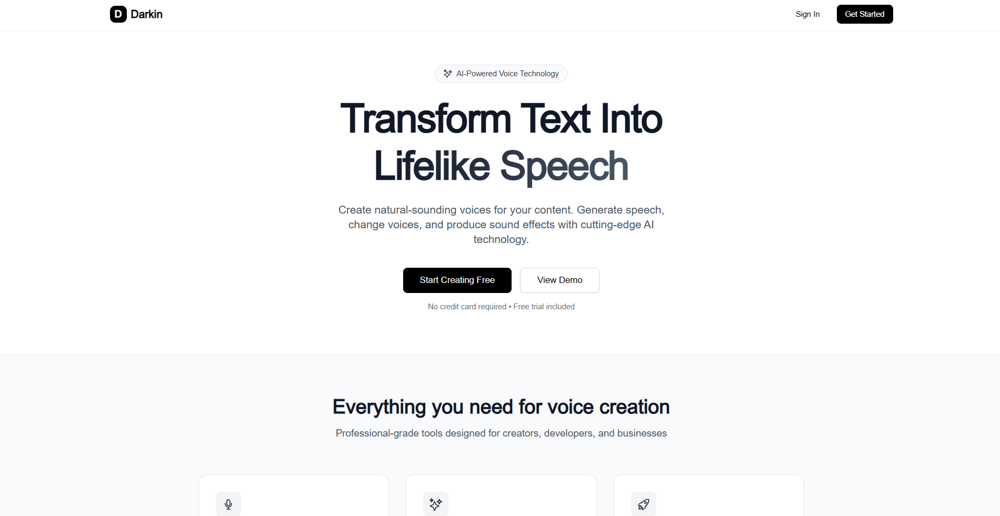

## Overview
In this project, I've built a full stack Darkin web application with features like text-to-speech,
voice conversion, and audio generation. Instead of external API services, I've self-hosted three AI models
(StyleTTS2, Seed-VC, and Make-An-Audio) from GitHub, fine-tune them to specific voices, then expose inference endpoints via FastAPI and deploy via Modal platform.
The AI backend will be built using Python and Pytorch with power GPU platform Modal. I've created a Next.js application
where users can use the AI models to generate audio, and also switch between voices and view previously generated audio
files, stored in an S3 bucket. The project includes user authentication, a credit system, and an Inngest queue to prevent overloading of
the server hosting the AI models. The web application is built on the T3 Stack with Next.js, React, TailwindCSS, ShadcnUI, and Better Auth.

Features:
- 🔊 Text-to-speech synthesis with StyleTT2
- 🎭 Voice conversion with Seed-VC
- 🎵 Audio generation from text with Make-An-Audio
- 🤖 Custom voice fine-tuning capabilities
- 🚀 Deploy AI model by Modal with GPU
- 🧱 FastAPI backend endpoints
- 📊 User credit management system
- 🔄 Inngest queue to prevent server overload
- 💾 AWS S3 for audio file storage
- 👥 Multiple pre-trained voice models
- 📱 Responsive Next.js web interface
- 🔐 User authentication with Better Auth
- 🎛️ Voice picker
- 📝 Generated audio history
- 🎨 Modern UI with Tailwind CSS, Shadcn UI

## Models Used in Video
- Voice-to-voice: [seed-vc](https://github.com/Plachtaa/seed-vc)
- Text-to-speech fine-tuning: [StyleTTS2Finetune](https://github.com/IIEleven11/StyleTTS2FineTune)
- Text-to-speech: [StyleTTS2](https://github.com/yl4579/StyleTTS2)
- Text-to-SFX: [Make-an-audio](https://github.com/Text-to-Audio/Make-An-Audio)

## Setup
Follow these steps to install and set up the project.

### Clone the Repository and navigate to the project directory
```bash
git clone https://github.com/conbopk/darkin.git
cd darkin
```

### Install Python
Download and install Python if not already installed. Use the link below for guidance on installation: [Python Download](https://www.python.org/downloads/)

### Clone the repos of open source models used for backend
```bash
# StyleTTS2 for text-to-speech
git clone https://github.com/yl4579/StyleTTS2.git

# StyleTTS2FineTune for text-to-speech fine-tuning and build dataset
git clone https://github.com/IIEleven11/StyleTTS2FineTune.git

# seed-vc for speech-to-speech
git clone https://github.com/Plachtaa/seed-vc.git

# Make-An-Audio for text-to-sfx
git clone https://github.com/Text-to-Audio/Make-An-Audio.git
```

after cloning, cd into each dir of open source to proceed with setup according to the readme file.

### Frontend

Install dependencies:
```bash
cd elevenlabs-clone-frontend
npm i
```

Run:
```bash
npm run dev
```

### Queue
Run the local queue development server with Inngest:
```bash
cd elevenlabs-clone-frontend
npm run inngest
# or
npx inngest-cli@latest dev
```

### Setup AWS for S3 and IAM User
You have to set up your aws services for S3, IAM User for storage and upload user wav file.
